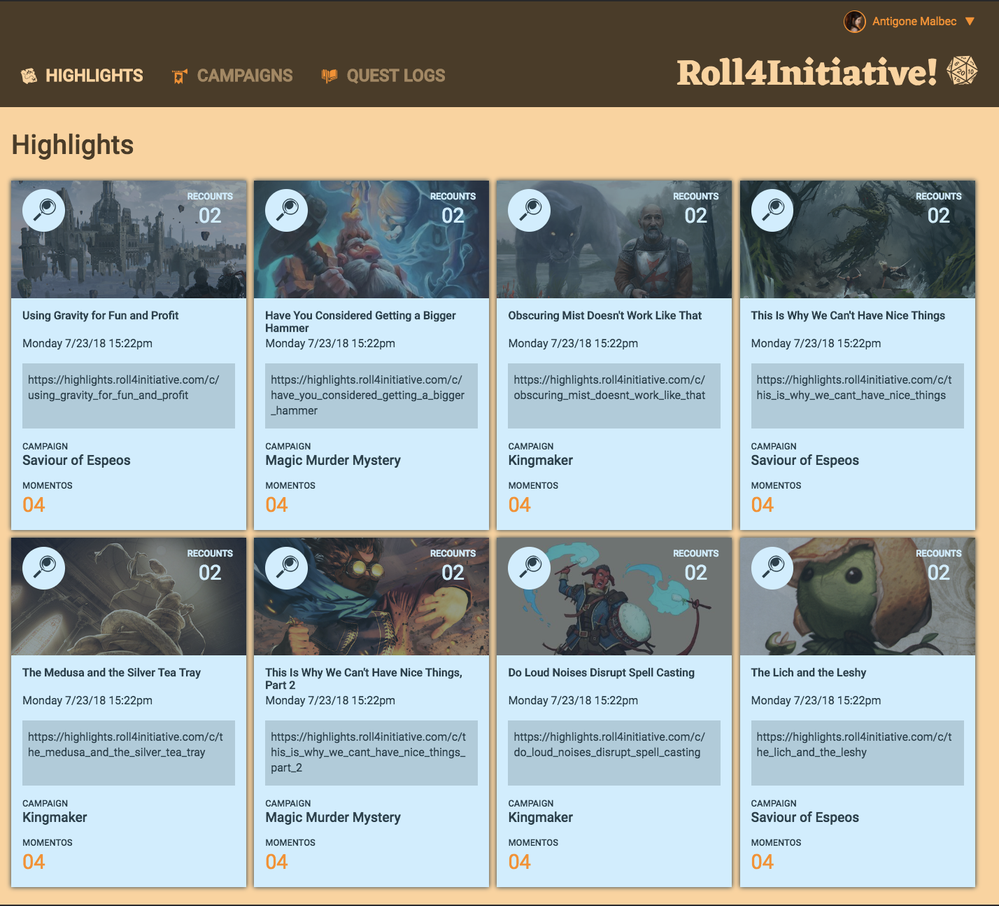

Static Comp Challenge 2 - Project Overview
==========================================

In the course of my studies at Turing, I was tasked with recreating the following composition, and making my own version responsive on multiple platforms.

### The Original Composition:

For this challenge, I kept with my original Pathfinder theme and created a webpage where players could store their most treasured game memories.

### My Version on Desktop:

